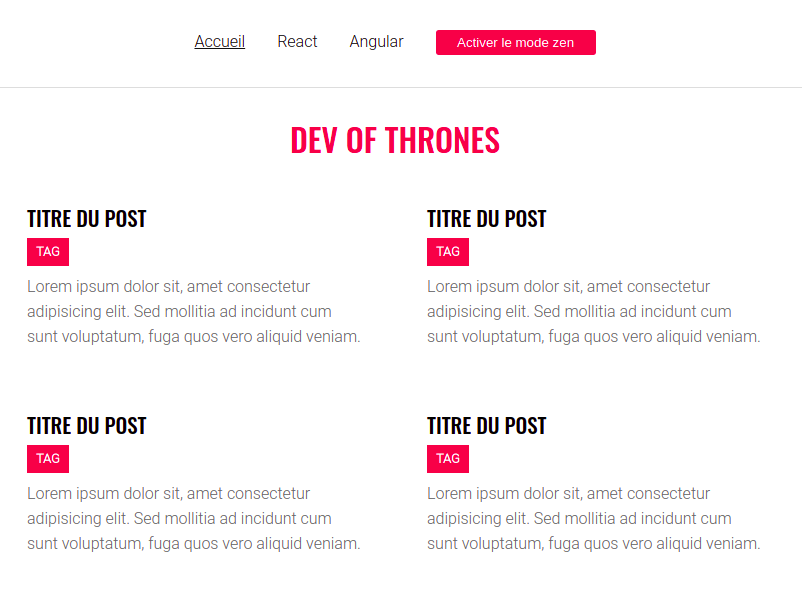

# Challenge Blog

Ce projet est un challenge que j'ai effectué pendant ma [formation O'Clock](https://oclock.io/formations/developpeur-web-fullstack-javascript), durant le mois de spécialisation React.\
Il s'agissait de créer un blog avec **React**, en récupérant les informations des articles sur une API grâce à **Axios**.



## Technologies

- React.js
- React router dom
- Javascript
- Sass
- Axios

## Installation

```
git clone https://github.com/Nina-petit/Formation-Blog.git
cd Formation-Blog
npm install
npm start
```

## Fonctionnalités

- Pouvoir appuyer sur le bouton "Loading" pour récupérer les informations des articles sur une API et les afficher
- Pouvoir voir les articles selon le sujet
- Activer et désactiver le mode zen grâce à un bouton, pour que la taille des articles change